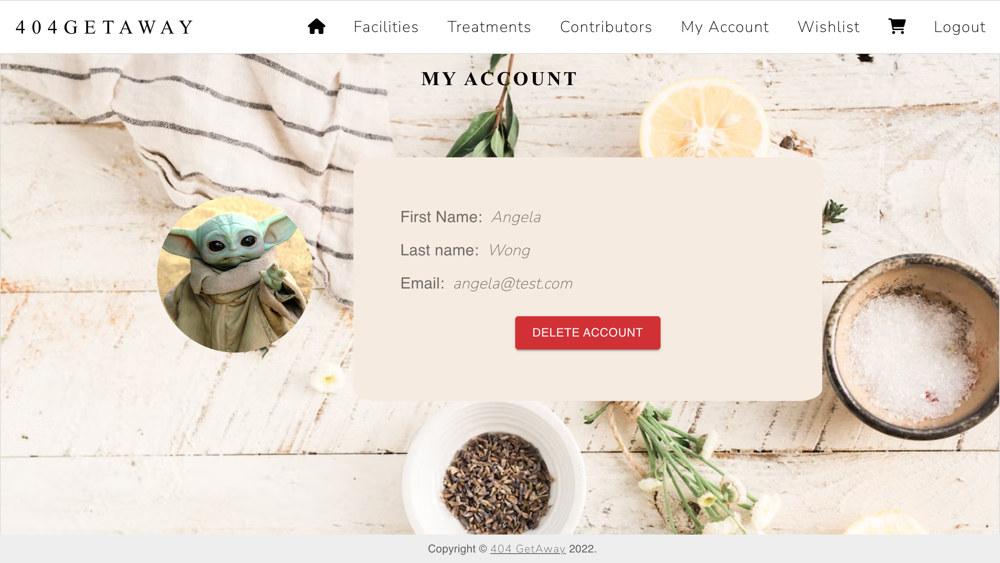
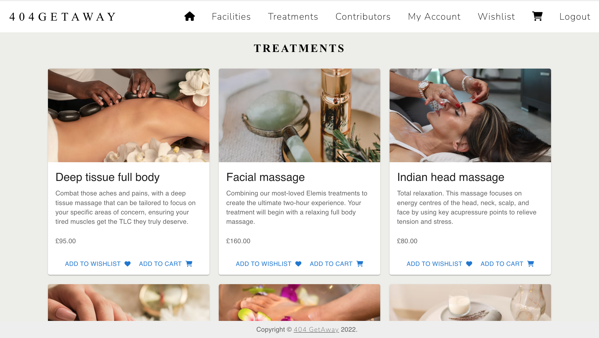
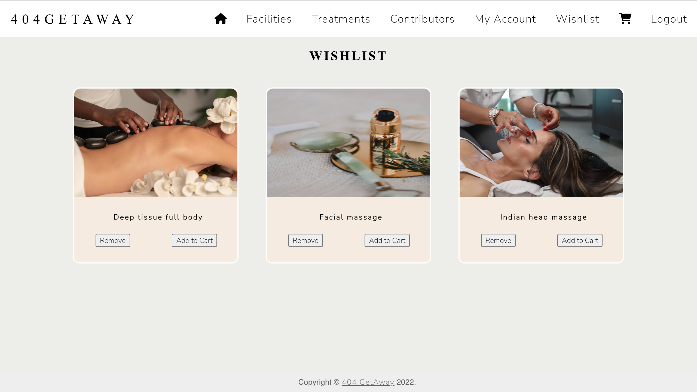
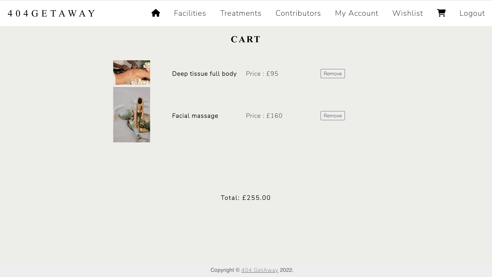

# Spa Retreat Project

404GETAWAY, a MERN stack application.

## User Story

```
AS A USER
I want to view the facilities and treatments at '404GETAWAY'
SO THAT I can keep a list of treatments to purchase

WHEN I am logged in to the site
I will be able to view and delete my account
I will be able to to save and retrieve treatments from my wishlist
I will be able to to add items to my cart
```

## Table of Contents

- [User Story](#user-story)
- [Technologies Used](#technologiesdependencies-used)
- [Installation](#installation)
- [Usage](#usage)
- [Screenshots](#screenshots)
- [Contributing](#contributing)
- [Deployed Link](#deployed-link)
- [Licence](#licence)
- [Future Development](#future-development)
- [Contact Us](#contributing)

## Technologies/Dependencies Used

- MongoDB
- Express.js
- React.js
- Node.js
- JavaScript
- JWT
- Apollo
- Mongoose
- graphql
- bycrpyt
- CSS
- Material UI
- Fontawesome

## Installation

```
git clone git@github.com:angelawong3/spa-retreat-project.git
cd spa-retreat-project
npm install

```

## Usage

```
npm run seed
npm run develop
```

## Screenshots

Demo video: https://drive.google.com/file/d/15I2OkklTKDhIb-NWAik5MFrK2VYsSnYD/view?usp=sharing









## Contributing

If you would like to contribute on this project at all, please contact anyone of us via email. All personal details are in our 'contributors' page.

## Deployed Link

```
https://spa-retreat-project.herokuapp.com/

```

## Licence

[](https://opensource.org/licenses/MIT)

## Future Development

This application is a prototype which was created in two weeks. Our vision for future development is:

1. Add availability 'stock levels' of treatments
2. Add date choice for the user when buying their treatment
3. Add loyalty points on a users accounts when buying treatments

## Contact Us

- Angela Wong: angelawong3@yahoo.com
- Mohammed Hassan: mohamedisaaq0@gmail.com
- Keyur M: keyurmist@gmail.com
- Alice Bryer: alicebryer123@gmail.com
- Ahmed Shahnawaz: iahmed.s1@icloud.com
- Aisha Abdi: aishahajisirad@gmail.com
- Anfal Ali: Anfal.ali_@hotmail.co.uk
- Idil Osman: Idil_abukar@live.se
